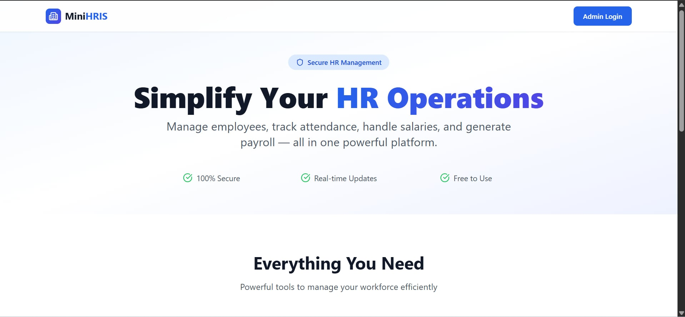
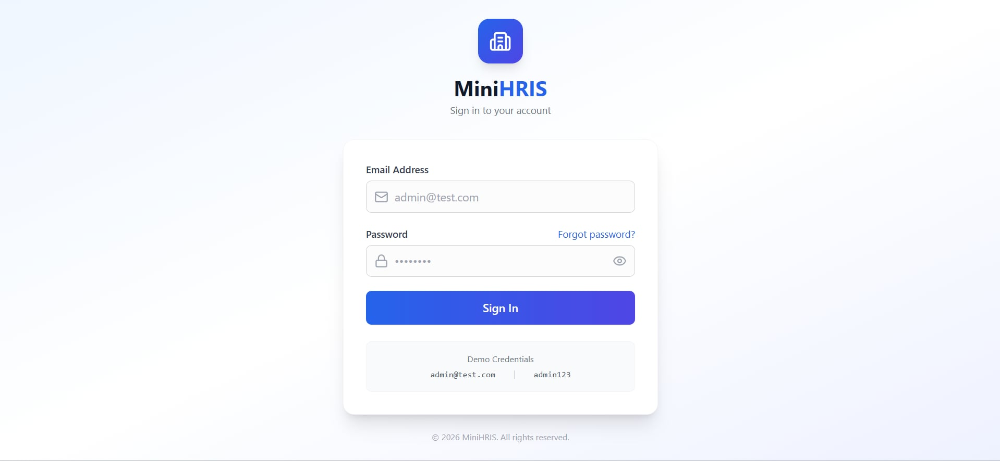
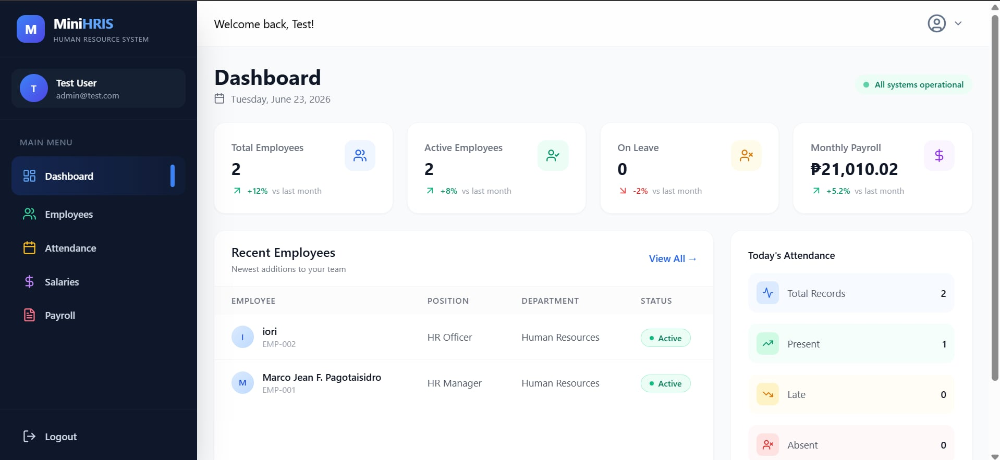
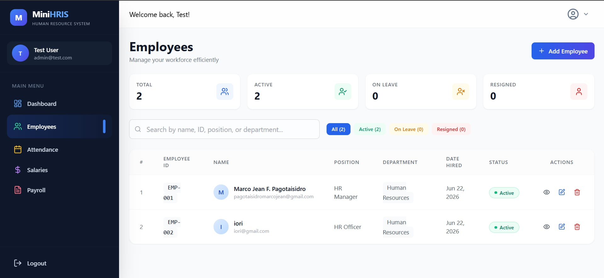
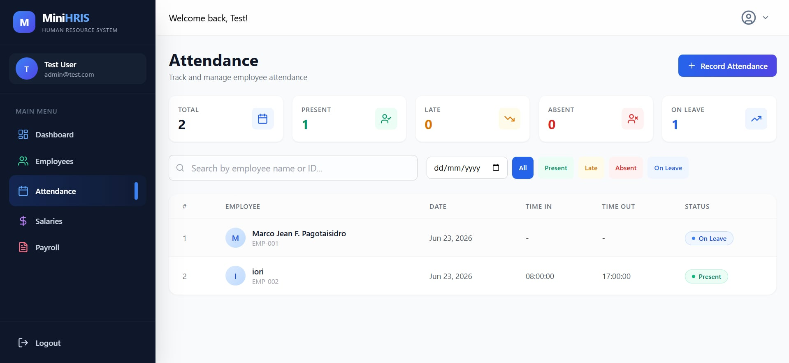
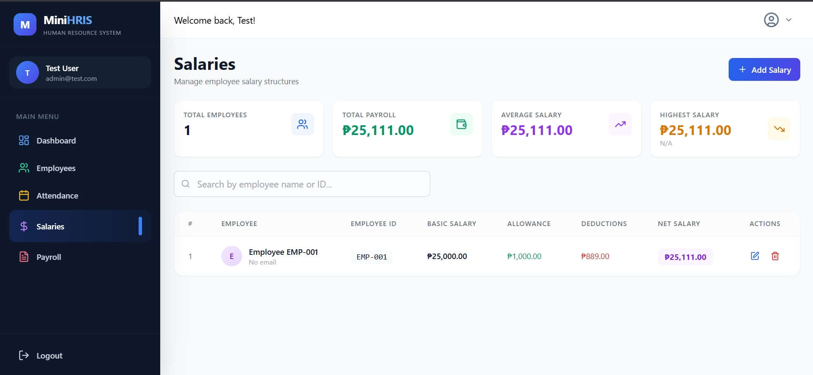
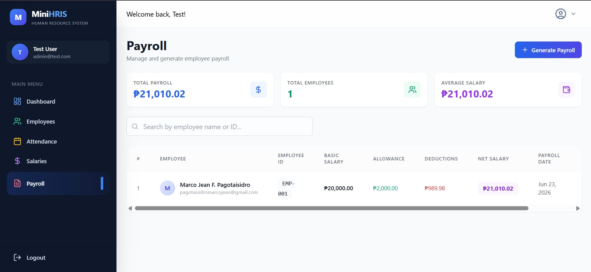

# MiniHRIS - Human Resource Information System


A complete Human Resource Management System built with Laravel API and React TypeScript frontend. Manage employees, attendance, salaries, and payroll in one place.

## 📋 Table of Contents
- [Features](#features)
- [Tech Stack](#tech-stack)
- [Installation Guide](#installation-guide)
- [API Documentation](#api-documentation)
- [Screenshots](#screenshots)
- [Project Structure](#project-structure)
- [Author](#author)

## ✨ Features

### 👥 Employee Management
- Full CRUD operations (Create, Read, Update, Delete)
- Auto-generated Employee IDs (EMP-001, EMP-002, etc.)
- Employee status filtering (Active, Resigned, On Leave)
- Search by name, ID, or department

### 📅 Attendance Tracking
- Record attendance with Time In / Time Out
- Attendance status: Present, Late, Absent, On Leave
- Summary cards (Present, Late, Absent, On Leave)
- Filter by employee and date range

### 💰 Salary Management
- Set fixed salary per employee
- Auto-calculate Net Salary (Basic + Allowance - Deductions)
- Summary cards (Total Payroll, Average Salary, Highest Salary)
- Prevent duplicate salary entries

### 📄 Payroll Generation
- Generate payroll from fixed salary data
- Auto-filled basic salary from employee's fixed salary
- Printable payroll slips (with Print & Close buttons)
- Summary cards (Total Payroll, Total Employees, Average Salary)

### 📊 Dashboard
- Real-time statistics
- Total Employees, Active Employees, On Leave, Monthly Payroll
- Recent employees table

### 🔐 Security
- Laravel Sanctum API authentication
- Role-based authorization (Admin/Employee)
- CSRF/XSS protection
- SQL injection prevention

## 🛠️ Tech Stack

### Backend
| Technology | Version |
|------------|---------|
| PHP | 8.2+ |
| Laravel | 11.x |
| MySQL | 8.0+ |
| Laravel Sanctum | 4.x |
| Composer | 2.x |

### Frontend
| Technology | Version |
|------------|---------|
| React | 18.x |
| TypeScript | 5.x |
| Vite | 5.x |
| Tailwind CSS | 3.x |
| React Router | 6.x |
| Axios | 1.x |
| Lucide Icons | Latest |

## 📦 Installation Guide

### Prerequisites
- PHP 8.2 or higher
- Composer
- MySQL 8.0 or higher
- Node.js 18+ and npm

### Step 1: Clone the Repository
```bash
git clone https://github.com/marcojeandev/minihris.git
cd minihris

Step 2: Backend Setup (Laravel)
2.1 Install PHP dependencies
cd backend
composer install

2.2 Configure Environment
cp .env.example .env

Edit .env file:
DB_CONNECTION=mysql
DB_HOST=127.0.0.1
DB_PORT=3306
DB_DATABASE=hris_db
DB_USERNAME=root
DB_PASSWORD=

2.3 Generate Application Key
php artisan key:generate

2.4 Run Migrations
php artisan migrate

2.5 Create Admin User (Optional)
php artisan db:seed --class=DatabaseSeeder
or go to database to get exported sql file

2.6 Start Backend Server
php artisan serve

Step 3: Frontend Setup (React)
3.1 Navigate to Frontend
cd ../frontend

3.2 Install Node dependencies
npm install

3.3 Create Environment File
cp .env.example .env

Edit .env:
VITE_API_URL=http://localhost:8000/api

3.4 Start Development Server
npm run dev

Frontend runs on: http://localhost:5173
```
## 📸 Screenshots

### Landing Page


### Login Page


### Dashboard


### Employees Management


### Attendance Tracking


### Salary Management


### Payroll Summary


### Payroll Slip (Print Preview)

